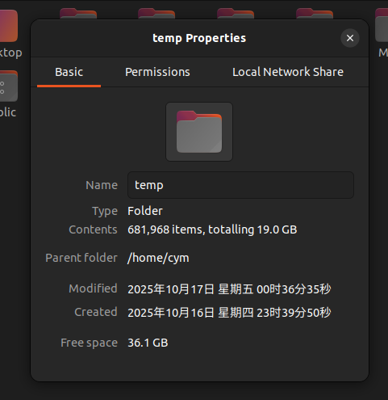

- 交叉编译工具链, 安装了一段时间. 

    在MECHREVO机器上: 

    ```bash
    cym@cym-MECHREVO:~/temp/riscv-gnu-toolchain/build -> master
    $ type riscv64-linux-gnu-gcc
    riscv64-linux-gnu-gcc is /usr/bin/riscv64-linux-gnu-gcc
    cym@cym-MECHREVO:~/temp/riscv-gnu-toolchain/build -> master
    $ type riscv64-unknown-linux-gnu-gcc
    riscv64-unknown-linux-gnu-gcc is hashed (/opt/riscv64/bin/riscv64-unknown-linux-gnu-gcc)
    ```

    

- Take 19.0 GB to clone & build, 1h+ needed. 

